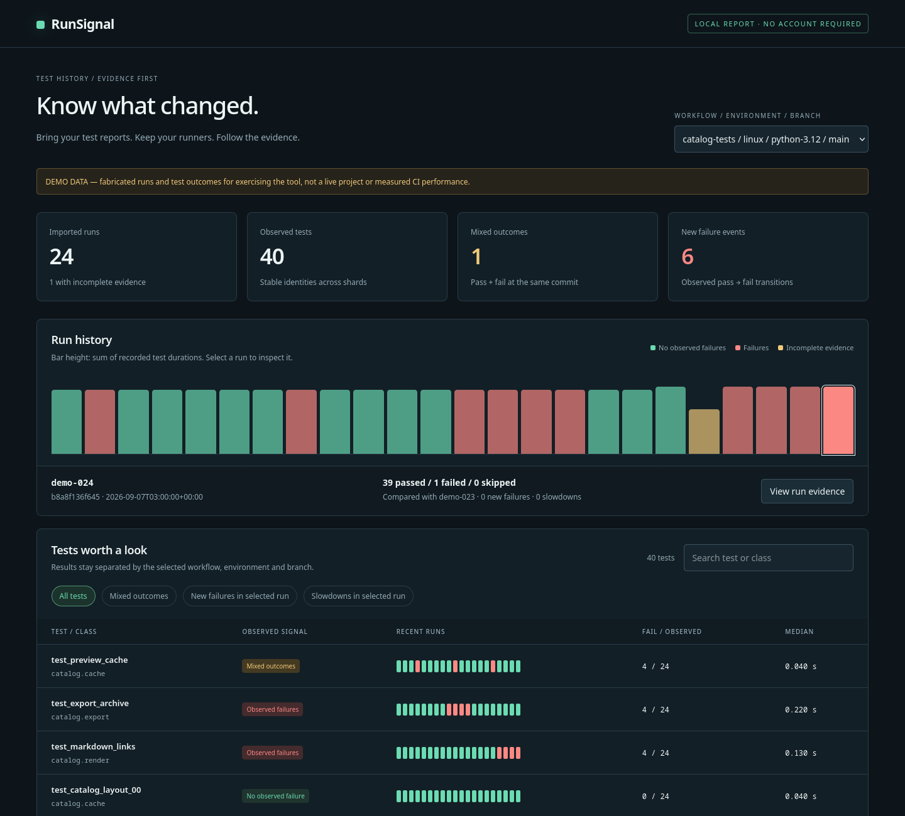

# RunSignal

**Local CI test history from the reports you already have.**

When a build is red, which tests just started failing? Which have both passed and failed at the same commit? Did a shard go missing, or did the tests disappear? RunSignal imports JUnit artifacts, keeps their history in SQLite, and builds an offline dashboard for answering those questions.



**Status: working v0.1.0.** Python 3.11+; standard library at runtime. No server, account, model API, runner replacement or telemetry. The included demo is synthetic. [Explore its HTML](docs/demo/index.html) by downloading/opening it in a browser; GitHub's source viewer does not execute the page.

## Try it

Download the source ZIP from GitHub and extract it, or clone the repository:

```sh
git clone https://github.com/SlightSignal/runsignal.git
cd runsignal
```

Then create and open a synthetic demo:

```sh
python3 examples/make_demo.py
python3 -m runsignal ingest examples/synthetic/manifest.json --db runsignal.sqlite3
python3 -m runsignal report --db runsignal.sqlite3 --out output
```

Open `output/index.html`. The demo contains 24 runs, 40 logical tests and 950 observations, including a missing shard, a repeated mixed-outcome test, new failures and a duration increase. It fabricates test outcomes to demonstrate behavior; it does not measure a real project's CI improvement.

Alternatively, `python3 tools/build_release.py` builds `dist/runsignal.pyz`. Run that with Python from any directory:

```sh
python3 /path/to/runsignal.pyz ingest manifest.json --db history.sqlite3
python3 /path/to/runsignal.pyz report --db history.sqlite3 --out report
```

The zipapp requires no package installation. For an installed command, this repository also includes standard Python packaging metadata; installing from source needs setuptools 80+ to build, with no third-party runtime dependencies.

## What it does

- Imports explicitly listed JUnit shards with run, commit, branch, workflow and environment metadata.
- Retains report hashes, parser version and row/shard provenance; does not copy logs or failure-body text into exported reports.
- Makes repeated imports idempotent and rejects conflicting evidence for an existing run ID.
- Keeps duplicate identities visible and excludes them from comparisons instead of selecting whichever result looks better.
- Separates missing shards, skipped tests, unsupported results and observed passes/failures.
- Finds pass-to-fail transitions against the preceding comparable run, same-commit mixed outcomes and simple duration increases.
- Exports an interactive HTML file plus a full JSON snapshot. Search, filter by context, inspect run evidence and open each test's history.

## Bring your reports

Place a `manifest.json` beside the report directory:

```json
{
  "schema": 1,
  "runs": [{
    "id": "build-104-attempt-1",
    "commit": "abcdef1234567890abcdef1234567890abcdef12",
    "branch": "main",
    "workflow": "library-tests",
    "environment": "ubuntu-24.04 / python-3.12",
    "started_at": "2026-09-08T12:00:00Z",
    "expected_shards": ["unit", "integration"],
    "reports": [
      {"path": "reports/unit.xml", "shard": "unit"},
      {"path": "reports/integration.xml", "shard": "integration"}
    ]
  }]
}
```

Use one database per repository. Run IDs must identify distinct executions/attempts. Include the relevant job or workspace in `workflow`; use unique `classname`/`file` namespaces for separate packages. Include runner, runtime, matrix variant and other meaningful configuration in `environment`. RunSignal compares supplied context labels; it does not verify that two environments were identical.

The importer reads only the explicit relative files. It does not expand globs, extract archives, follow symlinks, discover accounts or download CI artifacts. If an expected shard is absent, omit its missing file from `reports` but leave its name in `expected_shards`; the run is marked incomplete. A manifest must include at least one received report per run. Jobs that produced no report are currently outside its view.

See [the data model and comparison rules](docs/DATA-MODEL.md) for identity, limitations and input caps.

## Why this project

A developer with sharded tests in a large monorepo [asked for a CI health overview tied to commits without replacing their runners](https://www.reddit.com/r/github/comments/1t3bmg2/tool_to_give_me_ci_health_overview/). RunSignal tackles the existing-artifact investigation part of that workflow. It does not yet provide automatic repository hookup or workflow-wide coverage.

There are strong alternatives: [Allure 3](https://allurereport.org/docs/v3/configure/) already supports local history, and [Trunk](https://docs.trunk.io/flaky-tests/detection) supports richer detection policies and environment variants. RunSignal's competitive hypothesis is a focused, inspectable artifact workflow with a standard-library CLI and portable database. No superiority, search-volume, adoption or paid-demand claim is established. [Research and comparison](docs/RESEARCH.md).

## Development and verification

```sh
python3 -m unittest discover -s tests -p 'test_*.py' -v
python3 tools/build_release.py
```

The first release was checked with 28 Python tests (26 independent core tests, one HTML-embedding test and one portable-archive regression), 10 real Firefox DOM interaction checks, and a packaged-CLI smoke test. See [verification](docs/VERIFICATION.md) for exact scope and evidence. Check [Actions](https://github.com/SlightSignal/runsignal/actions) for hosted CI results.

## Direction

The larger goal is a portable test-history workbench across CI providers. The next useful increments are explicit artifact/run adapters, real-world JUnit dialect fixtures, multi-workspace identity rules and richer run comparisons. [Roadmap](docs/ROADMAP.md).

Imported data remains local, but generated reports contain test names, paths and supplied run metadata. Review an export before sharing it. The tool does not redact arbitrary identifiers or prove that an input report is honest. It is a trusted local CLI, not a hardened public upload service or a sandbox for running customer code.

MIT license. Contributions should include a minimal permitted fixture and the expected observable behavior; see [CONTRIBUTING.md](CONTRIBUTING.md).
